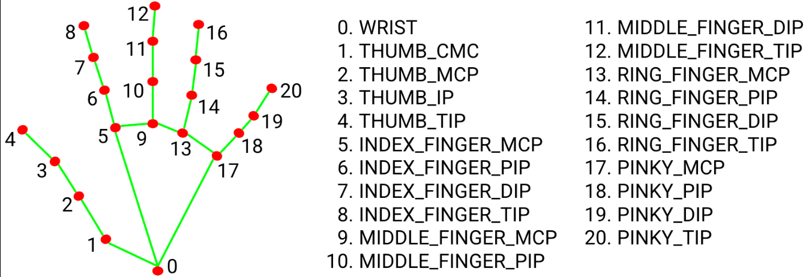
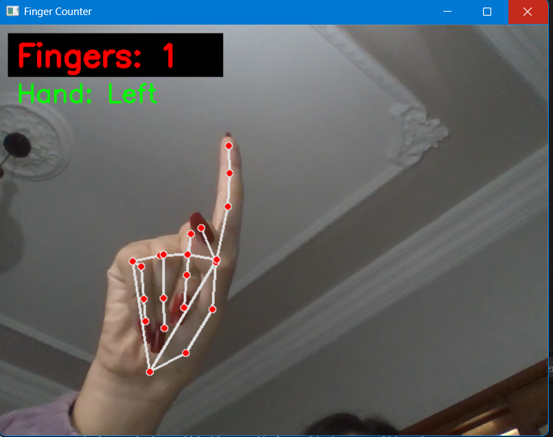
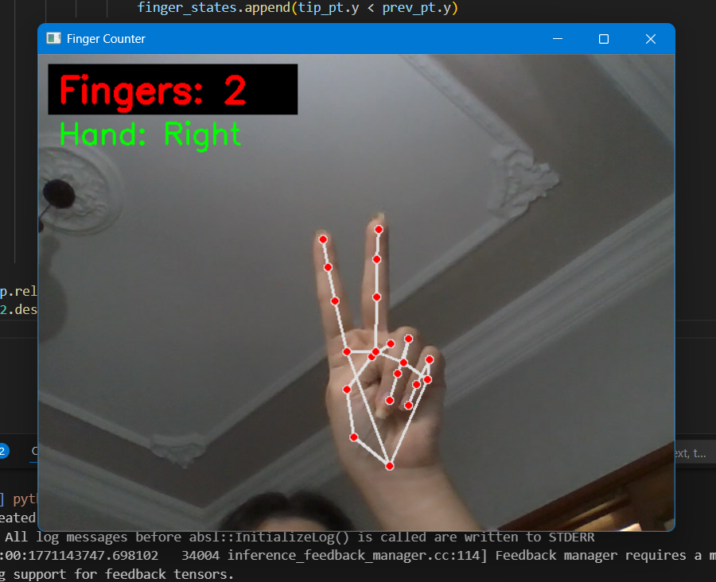

# 🤚 Smart Finger Counter with MediaPipe

A real-time finger counting system built using **Python**, **OpenCV**, and **MediaPipe**.  
The application detects hand landmarks from a webcam feed and counts the number of raised fingers in real time.

---

## 📌 Features

- ✅ Real-time hand tracking
- ✅ Finger counting (0–5)
- ✅ Supports left and right hands
- ✅ Flipped camera view for natural interaction
- ✅ Lightweight and fast processing

---

## 🛠️ Technologies Used

- Python 3.10+
- OpenCV
- MediaPipe

---

## 📷 Screenshots / Demo

### ✅ Hand Landmarks Detection

### ✅ Finger Counting Test

  
  

---

## 📷 How It Works

1. The webcam captures live video frames.
2. MediaPipe detects 21 hand landmarks.
3. The system compares fingertip positions with their corresponding joints.
4. The number of raised fingers is calculated.
5. The result is displayed on the screen in real time.

